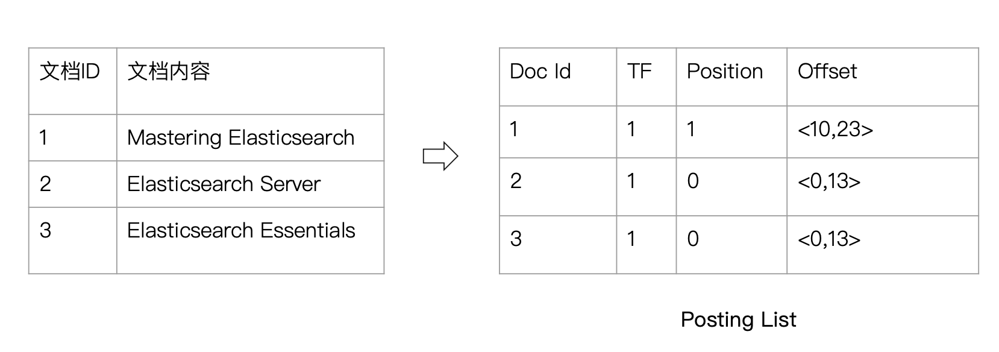
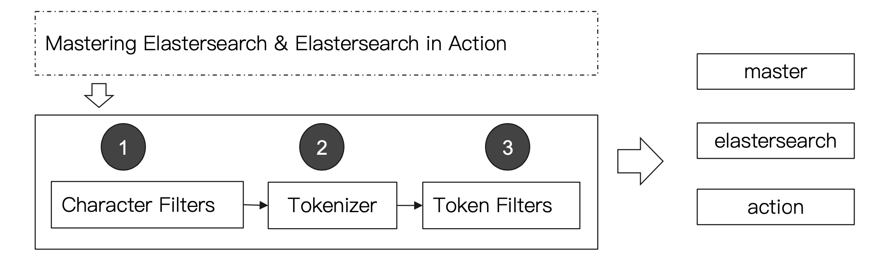

# 映射和分析

## 1、倒排索引

Elasticsearch使用一种倒排索引的数据结构来实现全文检索。倒排索引由文档中唯一出现的单词列表和这些单词出现的位置列表组成。

例如：有两个文档

1. `The quick brown fox jumped over the lazy dog`
2. `Quick brown foxes leap over lazy dogs in summer`

| Term   | Doc_1 | Doc_2 |
| ------ | ----- | ----- |
| The    | X     |       |
| quick  | X     |       |
| brown  | X     | X     |
| fox    | X     |       |
| jumped | X     |       |
| over   | X     | X     |
| the    | X     |       |
| lazy   | X     | X     |
| dog    | X     |       |
| Quick  |       | X     |
| foxes  |       | X     |
| leap   |       | X     |
| dogs   |       | X     |
| in     |       | X     |
| summer |       | X     |

倒排索引包含两部分

* 单词词典，记录所有的文档单词，记录所有单词到倒排列表的关联关系
  * 单词词典一般比较大，可以通过B+树或哈希拉链法实现
* 倒排列表，记录单词对应的文档结合，由倒排索引项组成
  * 倒排索引项
    * 文档ID
    * 词频TF — 该单词在文档中出现的次数，用于相关性打分
    * 位置 — 单词在文档中分词的位置，用于语句搜索
    * 偏移 — 记录单词在文档中开始结束位置，实现高亮显示



> 1. ES的Json文档中的每个字段都有自己的倒排索引
> 2. 可以不对某些字段做索引

## 2、Analyzer分析器

`Analysis 文本分析`是将全文本转换为一系列单词`term/token`的过程，也叫分词。`Analysis`是通过`Analyzer`实现的，可以使用ES内置的分析器或按需定制化分析器。

> 除了在数据写入时转换词条，在query查询时也要使用相同的分析器对查询语句进行分析。

### 2.1、分词器

分词器是专门处理分词的组件，由三部分组成

* `Charactor Filter`字符过滤器，处理原始文本，去除HTML标记
* `Tokenizer`分词器，按照规则切分单词
* `Token Filters`标记过滤，将切分的单词进行过滤，如小写、增加同义词等



### 2.2、内置分词器

* `Standard Analyzer`默认分词器，按词切分，小写处理
* `Simple Analyzer`按照非字母切分（符号过滤），小写处理
* `Stop Analyzer`停用词过滤（the，a，is），小写处理
* `WhiteSpace Analyzer`按照空格切分，不转小写
* `KeyWord Analyzer`不分词，直接将输入作为输出
* `Patter Analyzer`正则表达式，默认`\W+`（非字符分隔）
* `Language`提供30多种语言的分词器
* `自定义分词器`


#### 相关API:

**指定Analyzer**

```http
GET _analyzer
{
	"analyzer":"standard",
	"text":"Mastering Elasticsearch, elasticsearch in action"
}
```

**自定义分词**

```http
GET _analyze
{
  "tokenizer" : "keyword",
  "filter" : ["lowercase"],
  "char_filter" : ["html_strip"],
  "text" : "This is a <b>test</b>"
}
```

**指定索引字段**

```http
POST books/_analyzer
{
	"field":"title",
	"text":"Mastering Elasticsearch"
}
```

