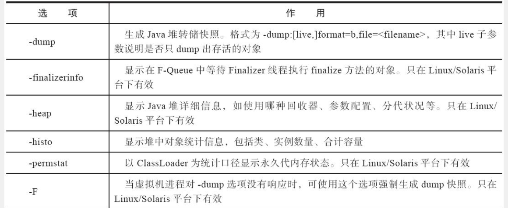
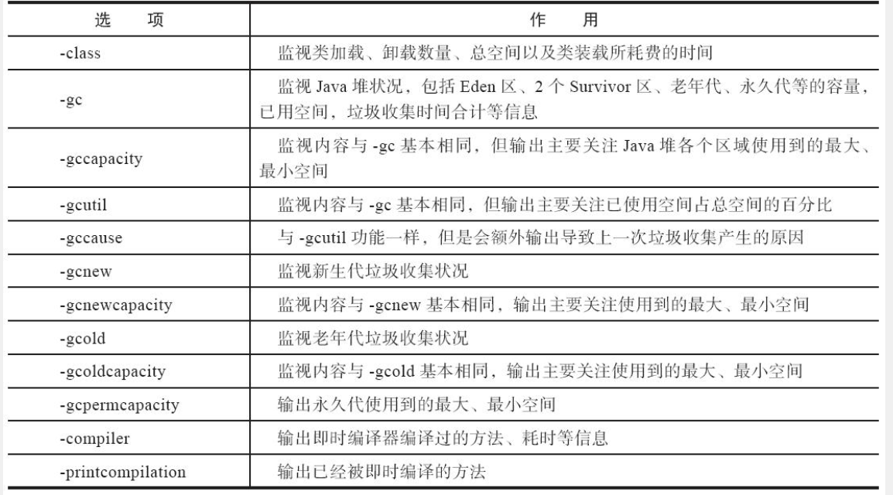

##1、jconsole

用于监控Java虚拟机使用JMX规范的图形工具。它可以监控本地和远程Java虚拟机，还可以监控和管理应用程序。

##2、jvisualvm

可以在JVM运行时提供有关Java技术的应用程序的详细信息。Java VisualVM提供内存和CPU分析、堆转储分析、内存泄露检测、MBean访问和垃圾收集。

## 3、jmap

生成堆转储快照（称为headdump或dump文件），查询finalize执行队列、Java堆和方法区的详细信息

jmap [option] vmid

## 4、jps

列出正在运行的虚拟机进程，并显示虚拟机执行主类的名称以及这些进程本地虚拟机的唯一ID

jps [options] [hostid]

| 选项 | 作用                                                 |
| :--: | ---------------------------------------------------- |
|  -a  | 只输出LVMID，省略主类的名称                          |
|  -m  | 输出虚拟机进程启动时传递给主类main()函数的参数       |
|  -l  | 输出主类的全名，如果进程执行的是JAR包，则输出JAR路径 |
|  -v  | 输出虚拟机进程启动时的JVM参数                        |

## 5、jstat

监视虚拟机各种运行状态信息的命令行工具

jstat [option vmid [interval] [count] ]

> Interval：查询间隔时间
>
> count：查询次数

## 6、jinfo

实时查看和调整虚拟机各项参数

jinfo [option] pid

> jdk8环境会有问题

## 7、jhat

与jmap搭配使用，用来分析jmap生成的堆转储快照。

缺点：

* jhat分析功能比较简陋
* 在本地机器运行很耗时、耗费硬件资源

## 8、jstack

生成虚拟机当前时刻的线程快照（一般称为threaddump或者javacore文件）

jstack [ option ] vmid

| 选项 |                     作用                     |
| :--: | :------------------------------------------: |
|  -F  | 当正常输出的请求不被响应时，强制输出线程堆栈 |
|  -l  |        除堆栈外，显示关于锁的附加信息        |
|  -m  | 如果调用到本地方法的话，可以显示C/C++的堆栈  |

>  线程快照是当前虚拟机内每一条线程正在执行的方法堆栈的集合，生成线程快照的目的是定位线程出现长时间停顿的原因

