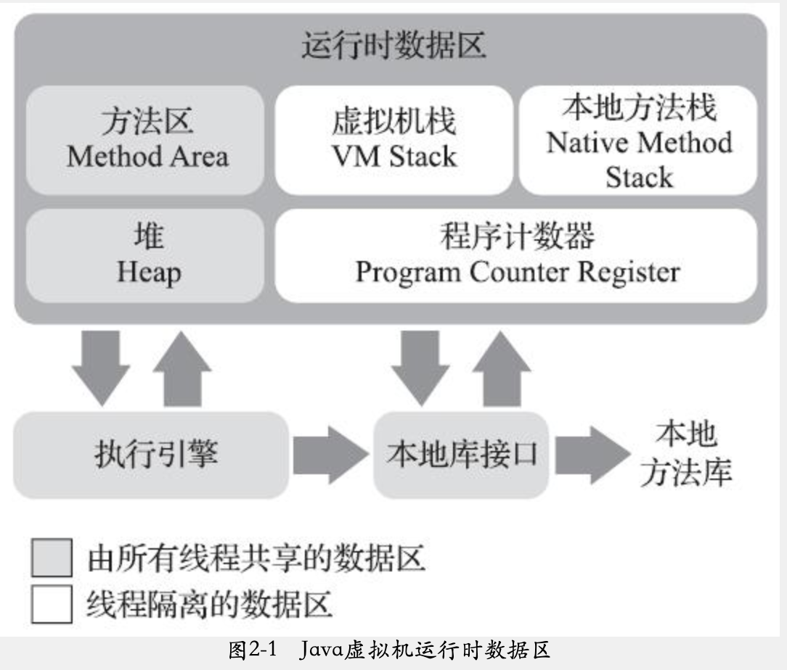
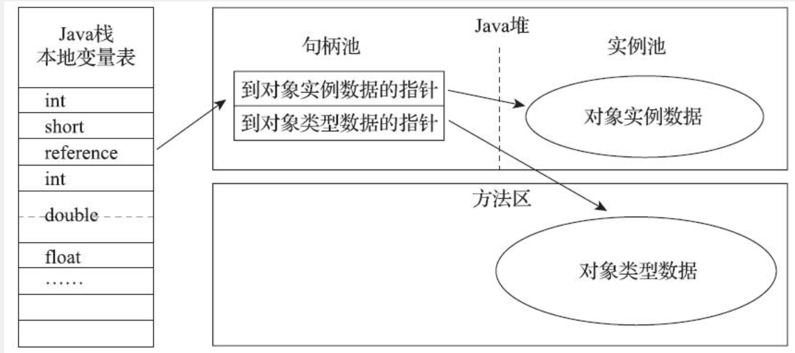
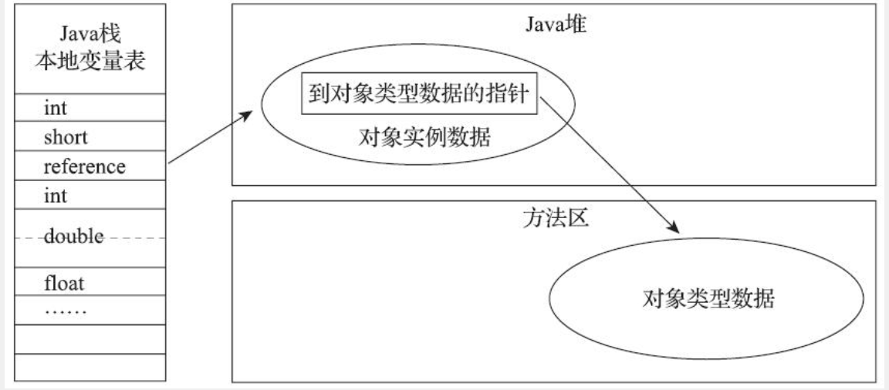

# 内存管理

## 运行时数据区域

Java虚拟机在执行Java程序的过程中会把它管理的内存划分为几个不同的数据区域。有些是随着虚拟机的进程一直存在，有些是随着线程的启动、结束而创建、销毁。

### 程序计数器

程序计数器是一块较小的空间，它可以看作是当前线程所执行的字节码的行号指示器。Java虚拟机是多线程执行的，每个处理器同一时刻只会处理一条线程，为了线程切换后能恢复到正确的位置，每个线程都需要一个独立的计数器，各个线程之间的计数器互不影响，独立存储，这种类型的区域就是“线程私有”的。

### 虚拟机栈

虚拟机栈也是线程私有的，它的生命周期和线程相同。每个方法在执行的时候都会创建一个栈桢`Stack Frame`，用于存储局部变量表、操作数栈、动态链接、方法出口等信息。每一个方法被调用直到执行完毕的过程就是该方法所对应的栈桢出栈和入栈的过程。

虚拟机栈被关注的最多的地方就是局部变量表，局部变量表中存放了编译期可知的各种基本数据类型（`boolean`、`byte`、`char`、`short`、`int`、`float`、`long`、`double`）、对象引用（`reference`类型）和`returnAddress`类型。

> + reference类型：可能是一个执行对象起始地址的引用指针，也可能是指向代表这个对象的句柄或者其他与此对象相关的位置。
>
> + returnAddress类型：执行一条字节码指令的地址。

虚拟机栈有两种异常：

- 如果线程请求的栈深度大于虚拟机所允许的深度，将抛出`StackOverflowError`异常。
- 如果虚拟机在动态扩展栈时无法申请到足够的内存空间，则抛出`OutOfMemoryError`异常。

### 本地方法栈

本地方法栈`Native Method Stacks`与虚拟机所发挥的作用很相似，区别在于虚拟机栈为虚拟机执行Java方法服务，而本地方法栈为虚拟机使用本地方法`Native`服务。

>抛出异常与虚拟机栈一样

### 堆

Java堆是虚拟机所管理的内存中最大的一块。Java堆是被所有线程共享的一块区域，在虚拟机启动时创建。堆中存放的是“几乎”所有的对象实例。Java堆是垃圾收集器集中管理的区域，因此也被称为“GC堆”。

Java堆可以是固定大小的，也可以是可扩展的（通过`-Xms`和`-Xmx`设置）。

如果Java堆中没有足够内存分配给对象，并且也无法扩展时，会抛出OOM异常。

>根据《Java虚拟机规范》规定，堆可以处于物理上不连续的内存空间，但在逻辑上它因该是连续的。

### 方法区

方法区也是线程共享的区域，用于存储已被虚拟机加载的类信息、常量、静态变量、即时编译后的代码等数据。

方法区的垃圾收集主要针对常量池的回收和对类型的卸载。

> 如果方法区无法满足新的内存分配需求，将抛出OOM异常。

### 运行时常量池

该区域是常量池的一部分，Class文件中的常量池表在类加载后会被放入到方法区的运行时常量池中。

运行时常量池除了可以存放编译期产生的常量，运行期也可以将新的常量放入。

当常量无法申请到内存分配时，抛出OOM异常。

> 常量池表：存放编译期生成的各种字面两和符号引用

## HotSpot虚拟机对象

### 对象的创建过程

+ 检查new指令的参数是否能在常量池中定位到一个类的符号引用

+ 检查这个符号引用所代表的类是否已被加载、解析和初始化过，如果没有，必须执行相应的类加载过程。

+ 为新对象分配内存

  > 方式一：指针碰撞
  >
  > 假设堆是绝对规整的，被分成两块，一块是被使用过的内存，另一块是空闲的内存，中间放着一个指针作为分界点的指示器。被分配的内存大小就是这个指示器向空闲内存挪动的距离（与对象大小相同）

  > 方式二：空闲列表
  >
  > 假设堆是不规整的，虚拟机需要直接维护一个列表，用于记录哪些内存块是可用的，在分配的时候从列表中找出一块足够大的内存分配给对象，同时更新表中的记录。

* 将分配到的内存空间都初始化为零值
* 对对象进行必要的设置

  > 这个对象是哪个类的实例、如何才能找到类的元数据信息、对象的哈希码、对象的GC分代年龄等信息

### 对象的内存布局

#### 对象头

* 对象自身的运行时数据

  > 哈希码、GC分代年龄、锁状态标志、线程持有的锁、偏向线程ID、偏向时间戳等

* 类型指针

  > 指向类型元数据

* 数组长度（如果对象是数组）

#### 实例数据

程序代码定义的各种类型的字段内容，数据的存储顺序受虚拟机分配策略参数`-XX:FieldAllocationStyle`和字段在Java源码中定义顺序的影响。

> HotSpot默认分配顺序：longs/doubles、ints、shorts/chars、bytes/booleans、oops(Ordinary Object Pointers)

#### 对齐填充

对齐填充可以不存在，仅仅是占位符的作用。对于HotSpot而言，由于对象的大小必须是8的整数倍，如果该对象不足8的整数倍，需要通过对象填充补全。

### 对象的访问定位

* 句柄

  

* 直接指针

  