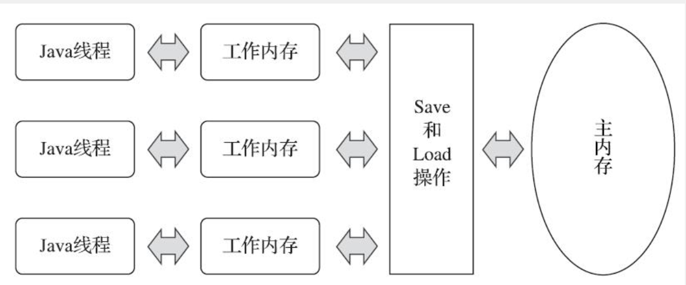
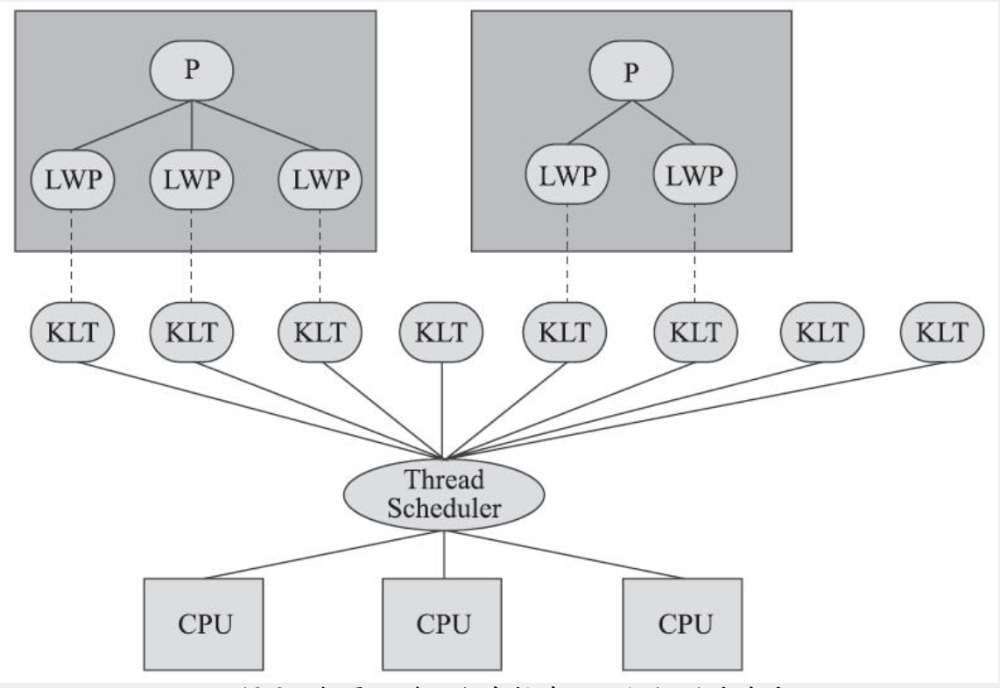
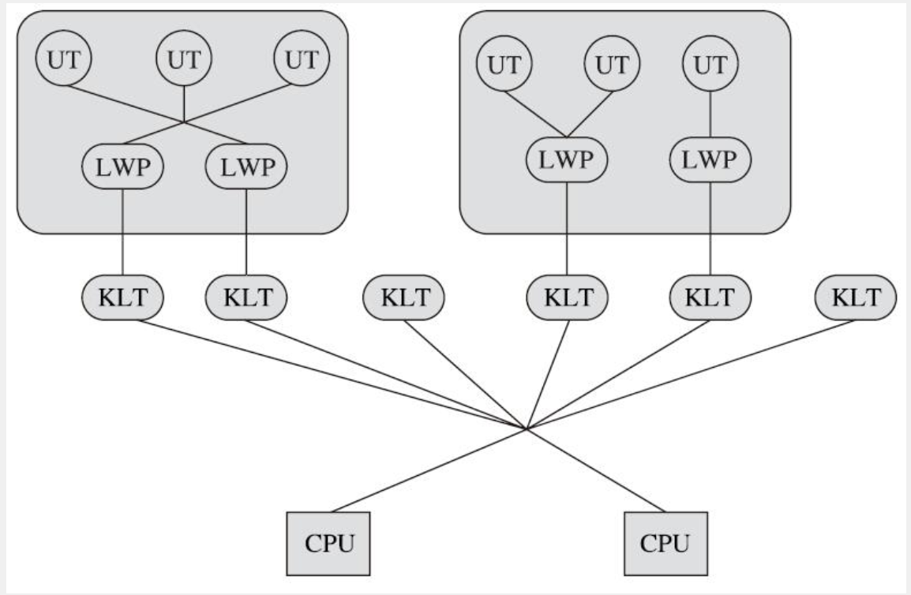
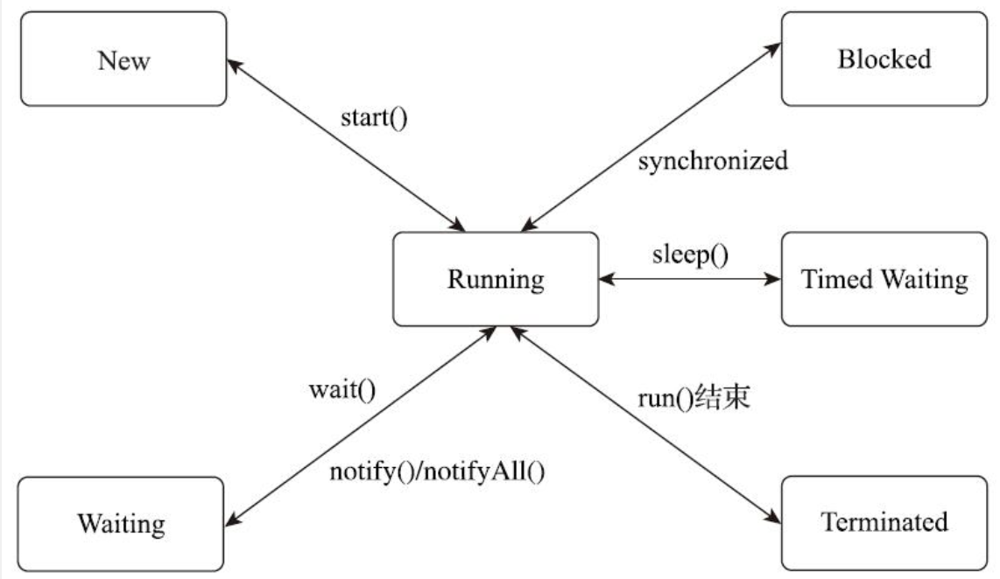

# Java内存模型与线程
## 1、Java内存模型
Java内存模型用来`屏蔽`各种硬件和操作系统的`内存访问差异`，以实现让Java程序在各种平台下都能达到`一致的内存访问效果`。

### 1.1、主内存与工作内存
Java中内存模型的主要目的是定义程序中各种变量的访问规则，即关注在虚拟机中把变量值存储到内存和从内存中取出变量值这样的底层细节。

Java内存模型规定所有的变量都存储在主内存中。每条线程有自己的工作内存，线程的工作内存中保存了被该线程使用的变量的主内存副本，线程对变量的所有操作都必须在工作内存中进行，不能直接读写主内存中的数据。线程间变量值的传递需要通过主内存完成。



> 此处的变量与Java中的变量有所区别，它包括实例字段、静态字段和构成数组对象的元素，但不包括局部变量与方法参数。

### 1.2、内存间的交互操作
Java内存模型定义了如下8种操作来规定内存间交互的实现细节。

作用于主内存的变量
* `lock（锁定）`：把一个变量标识为一条线程独占的状态
* `unlock（解锁）`：把一个处于锁定状态的变量释放出来，释放后的变量可以被其他线程锁定
* `read（读取）`：把一个变量的值从主内存传输到线程的工作内存中
  

作用于工作内存的变量
* `load（载入）`：把`read`操作中读到的变量值放入工作内存的变量副本中
* `use（使用）`：把工作内存中一个变量的值传给执行引擎
* `assign（赋值）`：把一个从执行引擎中接收的值赋给工作内存中的变量
* `store（存储）`：把工作内存中的一个变量的值传到主内存中

作用于主内存的变量
* `write（写入）`：把`store`操作从工作内存中得到的变量值放入主内存的变量中

>上述8种操作必须满足如下规则：
> * 不允许`read`和`load`、`store`和`write`单独出现
> * 不允许线程丢弃它最近的`assign`操作，即变量`assign`后必须同步回主内存
> * 不允许线程把没有发生`assign`操作的数据同步回主内中
> * 不允许在工作内存中使用一个未被初始化（`load`和`assign`）的变量
> * `lock`操作具有互斥性，执行了几次`lock`，就需要几次`unlock`
> * `lock`一个变量后，需要重新执行`load`或`assign`操作
> * 不允许`unlock`一个未被`lock`的变量，也不运行`unlock`其他线程锁定的变量
> * `unlock`操作之前必须把改变了同步回主内存中

### 1.3、volatile变量
volatile变量有两个特性：
1. volatile变量对所有的线程都是可见的
2. 禁止指令重排序优化

#### 保证可见性
volatile只能保证可见性，它不一定是线程安全的。
```java
public class Test{
    public static volatile int num = 0;

    public static void increase(){
        num ++;
    }

    public static void main(String[] args){
        Thread[] threads = new Thread[10];
        for (Thread thread : threads) {
            thread = new Thread(new Runnable() {
                @Override
                public void run() {
                    for (int i = 0; i < 10000; i++) {
                        increase();
                    }
                }
            });
            thread.start();
        }
        //等待所有线程都结束
        while (Thread.activeCount() > 1){
            Thread.yield();
        }
        System.out.println(num);
    }
}
```
每次运行程序输出结果都是小于100000，原因在于`num++`并不是一个原子性的操作，它包括读取变量的原始值、+1操作、写入工作内存。

在不符合以下2条规则的情况，仍然要加锁来保证原子性：
* 运算结果不依赖变量的当前值，或者能够保证只有一个线程能修改变量的值
* 变量不会与其他的状态变量共同参与不变约束

#### 指令重排序
禁止指令重排序有两层意思：
1. 在对volatile变量进行操作时，该语句之前的操作对后面的操作都是可见的
2. 不会改变volatile变量操作的位置，其操作在原来的语句执行顺序中不能改变
  
```java
//x是非volatile变量
//flag是volatile变量
x = 2;          //语句1
flag = true;    //语句2
x = 3;          //语句3
```
语句1的执行结果对于语句2和语句3都是可见的；语句2不会放到语句1的前面，也不会放在语句3的后面。

之所以会有这样的效果，通过汇编代码发现加入volatile关键字，会多一个lock前缀指令。这个指令相当于一个内存屏障，内存屏障会提供3个功能：
* 确保不会把后面的指令重排序到内存屏障之前的位置，也不会把前面的指令重排序到内存屏障后面
* 将缓存写入内存
* 写操作会导致其他处理器对应的缓存无效化

Java内存模型对volatile变量定义的特殊规则：
* `load`和`use`必须一起出现，`load`在前，`use`在后；即每次使用一个变量时必须先从主内存刷新最新的值
* `assign`和`store`必须一起出现，`assign`在前，`store`在后；即每次修改变量后都必须同步回主内存

### 1.4、先行发生原则
Java中有一个`Happens-Before`原则，用于判断数据是否存在竞争，线程是否安全。
* **程序次序规则**：在一个线程内，按照流程控制流顺序，前面的操作先行发生于后面的操作
* **管程锁定规则**：一个`unloack`必须先行发生于同一个锁的`lock`
* **volatile变量规则**：对一个`volatile`变量的写操作先行发生于后面对该变量的读操作
* **线程启动规则**：`Thread`对象的`start()`方法先行发生于此线程的每一个动作
* **线程终止规则**：线程中的所有操作都先行发生于对此线程的终止检测，检测手段有`Thread::join()`、`Thread::isAlive()`
* **线程中断规则**：对线程`interrupt()`方法的调用先行发生于被中断线程的中断事件检测
* **对象终结规则**：一个对象的初始化先行发生于它的`finalize`方法的开始
* **传递性**：操作A先行发生于操作B，操作B先行发生于操作C，那么操作A肯定先行发生于操作C

> 先行发生不等于时间上的先发生

## 2、Java与线程
### 2.1、线程的实现
实现线程主要有三种方式：
* 使用**内核线程**实现（1:1）
* 使用**用户线程**实现（1:N）
* 使用**用户线程**加**轻量级进程**混合实现（N:M）

#### 2.1.1、内核线程实现  
内核线程`KLT`是由操作系统内核支持的线程，这种线程由内核来完成线程切换，内核通过操纵调度器对线程进行调度，并负责将线程的任务映射到各个处理器上。

程序使用的线程其实使用的是内核线程的一种高级接口————**轻量级进程**`LWP`，轻量级进程就是我们通常意义上讲的线程，每个`LWP`都由一个内核线程支持，其关系是**1:1**的关系。



#### 2.1.2、用户线程实现
广义上说，一个线程只要不是内核线程，都可以认为是用户线程`UT`的一种。

狭义上，用户线程是完全建立在用户空间的线程库上，系统内核不能感知到用户线程的存在及如何实现的。用户线程的建立、同步、销毁和调度完全在用户态中完成，不需要内核的帮助。用户线程可以不需要切换到内核态，操作快速且消耗低，能支持大规模的线程数量，进程与用户线程是1:N的关系。

#### 2.1.3、混合实现
混合实现下，既存在用户线程，也存在轻量级进程。用户线程还是完全建立在用户空间中，轻量级进程作为用户线程和内核线程之间的桥梁，这样可以使用内核线程提供的线程调度功能及处理器映射，并且用户线程的系统调用要通过轻量级进程来完成。在这种混合模式中，用户线程和轻量级进程的关系是N:M。



#### 2.1.4、Java线程的实现
HotSpot中，它的每一个Java线程都直接映射到一个操作系统原生线程来实现，HotSpot自己不会干涉线程调度，全权交给操作系统处理。

### 2.2、 Java线程调度
线程调度是指系统为线程分配处理器使用权的过程，调度方式有两种：**协同式线程调度**和**抢占式线程调度**。

协同式调度的多线程系统，线程的执行时间**由线程本身控制**，线程自己的工作执行完后，会主动通知系统切换到另外一个线程上。协同的好处就是实现简单，而且线程执行完后才会进行线程切换，切换操作对线程自己是可知的，所以没有什么线程同步的问题。坏处就是线程的执行时间不可控，且因为不告知系统切换线程，有可能会发生线程阻塞。

抢占式调度的多线程系统，每个线程**由系统分配执行时间**，线程的切换不由线程本身决定。抢占式的好处就是线程的执行时间可控，不会发生线程阻塞

### 2.3、状态转换
Java定义了6中线程状态，分别是：
* **新建`New`**：创建后尚未启动的线程
* **运行`Runnable`**：包括os线程状态中的`Running`和`Ready`，处于此状态的线程可能正在执行，也可能正在等待os为它分配执行时间
* **无限期等待`Waiting`**：该状态的线程不会被分配处理器执行时间，需要等待被其他线程显示唤醒。进入该状态的方式：
  * `Object::wait()`方法，无Timeout参数
  * `Thread::join()`方法，无Timeout参数
  * `LockSupport::park()`方法
* **期限等待`Timed Waiting`**：该状态的线程不会被分配处理器执行时间，在一定的时间后会由系统唤醒。该状态的进入方法：
  * `Thread::sleep()`方法
  * `Object::wait()`方法，有Timeout参数
  * `Thread::join()`方法，有Timeout参数
  * `LockSupport::parkNanos()`方法
  * `LockSupport::parkUntil()`方法
* **阻塞`Blocked`**：线程被阻塞，等待获取一个排它锁
* **结束`Terminated`**：线程被终止，线程结束执行
  
以上6种状态的转换关系如下图：



## 3、Java与协程
1:1的内核线程模型是目前Java虚拟机线程实现的主流选择，但是这种方式线程切换、调度的成本高昂。内核线程的调度成本主要来自于用户态和核心态之间的状态转换。而这两种状态转换的开销主要来自于相应中断、保护和恢复执行现场的成本。

协程其实就是用户线程的协同式调度，协程的主要优势是轻量，进行量化的话，在不显示设置`-Xss`或`-XX:ThreadStackSize`的情况下，64位HotSpot的线程栈容量默认是1MB，而一个协程的栈通常在几百个字节到几KB之间。