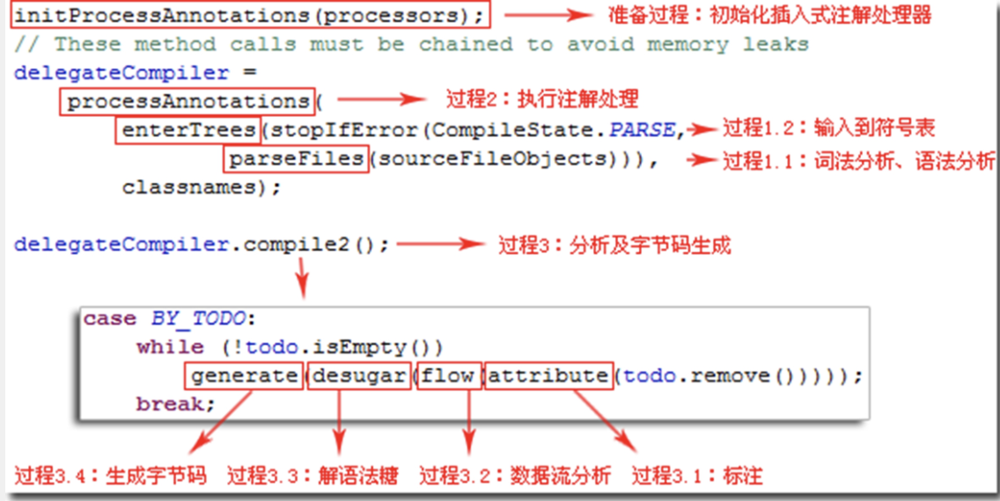

# 前端编译与优化
## <font color="#5DC49B">1、Javac编译器</font>
从Javac的总体结构来看，编译过程大致可以分为1个准备过程和3个处理过程：
1. 准备过程：初始化插入式注解处理器
2. 解析与填充符号表过程：
    * 词法、语法分析。将源代码的字符流转变为标记集合，构造出抽象语法树
    * 填充符号表。产生符号地址和符号信息
3. 插入式注解处理器的注解处理过程
4. 分析与字节码生成过程：
    * 标注检查。对语法的静态信息进行检查
    * 数据流及控制流分析。对程序动态运行过程进行检查。
    * 解语法糖。将简化代码便携的语法糖还原为原有的形式
    * 字节码生成。将前面各个步骤所生成的信息转化为字节码



### <font color="#5DC49B">1.1、解析与符号填充</font>
解析包括词法分析和语法分析两个步骤
#### <font color="#5DC49B">1.1.1 词法、语法分析</font>
词法分析是将源代码的字符流转变为标记集合的过程，标记是编译时的最小元素。关键字、变量名、字面量、运算符都可以作为标记。

语法分析是根据标记序列构造出抽象语法树的过程，抽象语法树`Abstract Syntax Tree, AST`是一种用来描述程序代码语法结构的树形表示方式，抽象语法树的每个节点都代表程序代码中的一个语法结构。例如，包、类型、接口、修饰符等都可以算是一种语法结构。
#### 1.1.2 符号填充
符号表`Symbol Table`是由一组符号地址和符号信息构成的数据结构，符号表中记录的信息在编译的不同阶段都要被用到。比如在语法分析的过程中，符号所登记的内容将用于语意检查和产生中间代码，在目标代码生成阶段，当对符号名进行地址分配时，符号表时地址分配的直接依据。

在Javac中，填充符号表的过程有com.sun.tools.javac.comp.Enter类实现，该过程的产出物是一个待处理列表，其中包含类每一编译单元的抽象语法树的顶级节点，以及package-info.java的顶级节点。

### 1.2、注解处理器
插入式注解处理器可以在编译期对代码中的特定注解进行处理，从而影响到前端编译器的工作过程。当这些处理器工作时，允许读取、修改、添加抽象语法树中的任意元素。如果这些处理器在处理注解期间对语法树进行过修改，编译器将回到解析及填充符号表的过程重新处理，直到所有插入式注解处理器都没有再对语法树进行修改为止，每次循环过程称为一个轮次`Round`。

在Javac源码中，插入式注解处理器的初始化过程是在initPorcessAnnotanions()中完成的，而它的执行过程则是在processAnnotations()方法中完成。这个方法会判断是否还有新的注解处理器需要执行，如果有的话，通过com.sun.tools.javac.processing.JavacProcessingEnvironment类的doProcessing()方法来生成一个新的JavaCompiler对象，对编译的后续步骤进行处理。

### 1.3、语义分析与字节码生成
语义分析主要是对结构上正确的源程序进行上下文相关性质的检查，譬如类型检查、控制流检查、数据流检查等。

#### 1.3.1 标注检查
标注检查的内容包括诸如变量使用前是否已被声明、变量和赋值之间的数据类型是否能够匹配等等。在标注检查中，还会顺便进行一个称为常量折叠的代码优化。
> 常量折叠就是将计算后的常量值标注在语法树上
标注检查步骤在Javac源码中的实现类是com.sun.tools.javac.comp.Attr类和com.sun.tools.comp.Check类。
#### 1.3.2 数据及控制流分析
数据流分析和控制流分析是对程序上下文逻辑更进一步的验证，它可以检查出诸如程序局部变量在使用前是否有赋值、方法的每条路径是否都有返回值、是否所有的受查异常都被正确处理了等问题。
#### 1.3.3 解语法糖
语法糖，是指在语言中添加某种语法，这个语法对语言的编译结果和功能并没有实际影响，但是却能更方便程序员使用该语言。通常来说，使用语法糖能够减少代码量、增加程序的可读性，从而减少程序代码出错的机会。
Java中常见的语法糖包括泛型、变长参数、自动装箱拆箱等等，Java虚拟机运行时并不直接这些语法，它们在编译阶段被还原回原始的基础语法结构，这个过程就是解语法糖。
#### 1.3.4 字节码生成
字节码生成是Javac编译过程的最后一个阶段，在Javac源码中由com.sun.tools.javac.jvm.Gen类完成。字节码生成不仅把前面生成的信息（语法树、符号表）转化成字节码指令写到磁盘中，编译器还进行了少量的代码添加和转换工作。比如生成构造器、优化程序逻辑等。
完成对语法树的遍历和调整之后，就会把填充了所有所需信息的符号表交到com.sun.tools.javac.jvm.ClassWriter类手上，由这个类的writeClass()方法输出字节码，生成最终的Class文件。

## 2、Java语法糖
### 2.1、泛型
泛型的本质是参数化类型或者参数多态的应用，即可以将操作的数据类型指定为方法签名中的一种特殊参数，这种参数类型能够用在类、接口和方法的创建中，分别构成泛型类、泛型接口和泛型方法。
Java中的泛型是“类型擦除式泛型”，即它只在程序源码中存在，在编译后的字节码文件中，泛型会被替换为原来的裸类型，并在相应的地方插入了强制转型代码。
#### 2.1.1、 类型擦除
“裸类型”被视为所有该类型泛型化实例的共同父亲类型，其作用是为了让所有泛型化的实例类型，譬如ArrayList<Integer>、ArrayList<String>这些全部自动成为ArrayList的子类型。
```java
Map<String, String> map = new HashMap<String, String>();
map.put("one","一");
map.put("two?","二");
System.out.println(map.get("one"));
System.out.println(map.get("tow"));
```
将这段代码编译成Class文件，然后在反编译后，泛型都被擦除了，如下所示：
```java
Map map = new HashMap();
map.put("one","一");
map.put("two?","二");
System.out.println((String)map.get("one"));
System.out.println((String)map.get("tow"));
```

“裸类型”的实现方案：在编译时直接把泛型化的实例类型还原回不带泛型的类型，只在元素访问、修改时自动插入一些强制类型转换和检查指令。

Java泛型的缺点：
* 擦除式泛型不支持原始类型数据，如int、long这些。
* 由于运行期无法获取到泛型类型信息，会让一些代码变得比较啰嗦。
* 擦除式泛型会丧失一些面向对象思想应有的优雅，带来一些模棱两可的模糊状况。

#### 2.1.1、 值类型
值类型与引用类型一样，具有构造函数、方法或是属性字段，而它与引用类型的区别在于它在赋值时通常时整体复制。值类型的实例很容易实现分配在方法的调用栈上，这意味着值类型会随着当前方法的退出而自动释放，不会给垃圾收集子系统带来任何压力。

### 2.2、条件编译
使用条件为常量的if语句，根据布尔常量值的真假，编译器会把分支中不成立的代码块消除掉。
```java
public static void main(String[] args){
    if(true){
        System.out.println("block 1");
    }else{
        System.out.println("block 2");
    }
}
```
该代码反编译后的结果：
```java
public static void main(String[] args){
    System.out.println("block 1");
}
```
由于这种条件编译的实现方式使用了if语句，所以它必须遵循最基本的Java语法，只能写在方法体内部，因此它只能实现语句基本块级别的条件编译，而没有办法实现根据条件调整整个Java类的结构。

## 3、注解处理器实现
继承抽象类javax.annotation.processiong.AbstractProcessor，实现`process()`方法
```java
//注解处理器框架的上下文环境对象，可以通过该对象创建新代码、向编译器输出信息、获取其他工具类
protected ProcessingEnvironment processingEnv;

//如果不修改语法树，可直接返回false
public abstract boolean process(Set<? extends TypeElement> annotations,RoundEnvironment roundEnv);
```

* `annotations`：此注解处理器所要处理的注解集合
* `roundEnv`：当前Round中抽象语法书节点，每个语法书节点都表示为一个Element
    > javax.lang.model.ElementKind中定义了18类Element，包括：
    > * 包（PACKAGE）
    > * 枚举（ENUM）
    > * 类（CLASS）
    > * 注解（ANNOTATION_TYPE）
    > * 接口（INTERFACE）
    > * 枚举值（ENUM_CONSTANT）
    > * 字段（FIELD）
    > * 参数（PARAMETER）
    > * 本地变量（LOCAL_VARIABLE）
    > * 异常（EXCEPTION_PARAMETER）
    > * 方法（METHOD）
    > * 构造函数（CONSTRUCTOR）
    > * 静态语句块（STATIC_INT）
    > * 实例语句块（INSTANCE_INT）
    > * 参数化类型（TYPE_PARAMETER, 泛型括号内的类型）
    > * 资源变量（RESOURCE_VARIABLE, try-resource中定义的变量）
    > * 模块（MODULE）
    > * 为定义的其他语法书节点（OTHER）

```java
@Documented
@Target(TYPE)
@Retention(RUNTIME)
public @interface SupportedAnnotationTypes {

    String [] value();
}
```
`@SupportedAnnotationTypes`注解vlaue中存放某一类注解，可用*匹配所有注解

```java
@Documented
@Target(TYPE)
@Retention(RUNTIME)
public @interface SupportedSourceVersion {

    SourceVersion value();
}
```
`@SupportedSourceVersion`指定处理哪些版本的Java代码

# 后端编译与优化
## 4、即时编译器
即时编译器在运行时将运行比较频繁的代码编译成本地机器码，并以各种手段尽可能进行代码优化。

### 4.1.1、解释器与编译器
解释器和编译器各有优势：当程序开始启动和执行时，解释器可以首次发挥作用，省去编译时间，立即运行。当程序启动后，随着时间的推移，编译器发挥作用，把越来越来多的代码编译成本地代码，这样可以减少解释器的中间损耗，获得更高的执行效率。

当程序运行环境中内存资源限制时，可以使用解释器节约内存，反之可以使用编译器提升效率。
解释器可以作为编译器激进优化时后备的“逃生门”，让编译器根据概率选择一些不能保证所有情况都正确，但大多数时候都能提升运行速度的优化手段，当激进优化的假设不成立时可以通过逆优化退回到解释状态继续执行。


HotSpot虚拟机内置了两个（或三个）即时编译器，其中两个编译器分别是“客户端编译器” `Client Compiler`和“服务端编译器”`Server Compiler`，也叫C1编译器和C2编译器。第三个是JDK10出现的、长期目标是代替C2的Graal编译器。

为了在程序启动响应和运行效率之间达到最佳平衡，HotSpot在编译子系统中加入了分层编译的功能。
分层编译：
* 第0层：程序纯解释执行，并且解释器不开启性能监控功能。
* 第1层：使用客户端编译器将字节码编译为本地代码来运行，进行简单可靠的稳定优化，不开启性能监控优化。
* 第2层：使用客户端编译器执行，仅开启方法及回边次数统计等有限的性能监控功能。
* 第3层：使用客户端编译器执行，开启全部性能监控，除了第2层的统计信息外，还会收集如分支跳转、需方法调用版本等全部的统计信息。
* 第4层：使用服务器端编译器执行，会启用更多编译时更长的优化，还会根据性能监控信息进行一些不可靠的激进优化。

实现分层编译后，解释器、客户端编译器和服务端编译器就会同时工作，用客户端编译器获取更高的编译速度，用服务端编译器获取更好的编译质量，在解释执行的时候也无须额外承担收集性能监控信息的任务，而在服务端编译器采用高度复制的优化算法时，客户端编译器可以先用简单优化为它争取更多的时间。

### 4.2.1、编译对象与触发条件
即时编译器的目标是“热点代码”，包括：
* 被多次调用的方法
* 被多次执行的循环体

"热点代码"的判定方式：
* 基于采样的热点探测。虚拟机会周期性地检查各个线程的调用栈顶，如果发现某个（某些）方法经常出现在栈顶，那这个方法就是“热点方法”。
* 基于计数器的热点探测。虚拟机会为每个方法（甚至是代码块）建立计数器，统计方法的执行次数，如果执行次数超过一定的阙值就认为它是“热点方法”。

HotSpot采用基于计数器的热点探测，为了实现热点计数，HotSpot为每个方法准备了两类计数器：方法调用计数器和回边计数器（“回边”就是在循环边界往回跳转）。当虚拟机运行参数确定的前提下，两个计数器都有一个明确的阙值，计时器阙值一旦溢出，就会触发即时编译。

#### 4.2.1.1、方法调用计数器
方法调用计数器用于统计方法被调用的次数，默认阙值在客户端模式下是1500次，服务端是10000次，这个阙值可通过虚拟机参数-XX：CompileThreshold来人为设定。


在默认设置下，方法调用计数器统计的是一个相对的执行频率，即一段时间内方法被调用的次数。当超过一定的时间限度，如果方法的调用次数仍然不足以让它提交给即时编译器编译，该方法的调用计数器就会被减少一半，这个过程叫做方法调用计数器热度衰减，这段时间称为此方法统计的半衰周期，该动作会在虚拟机进行垃圾收集时被触发，可以使用参数-XX:-UseCounterDecay来关闭热度衰减，使用-XX:CounterHalfLifeTime参数设置半衰周期的时间，单位秒。

#### 4.2.1.2、回边计数器
回边计数器统计一个方法中循环体代码执行的次数，在字节码中遇到控制流向后跳转的指令就称为“回边”。

回边计数器使用参数-XX:BackEdgeThreshold来设置阙值，但HotSpot并未使用此参数，我们需要设置另一个参数-XX:OnStackReplacePercentage来间接调整我们计数器的阙值，其计算公式有两种：
* 客户端模式下，计算公式为：
$$\frac{方法调用计数器阙值 \times OSR比率}{100}$$
* 服务端模式下，计算公式为：
$$\frac{方法调用计数器阙值 \times OSR比率 - 解释器监控比率的差值}{100}$$

> * 方法调用计数器阙值： `-XX:CompileThreshold`
> * OSR比率：`-XX:OnStackReplacePercentage`
> * 解释器监控比率：`-XX:InterpreterProfilePercentage`
> 
> 客户端OSR比率默认值为933，如果都去默认值，客户端虚拟机的回边计数器的阙值为13995。
> 
> 虚拟机的OSR比率默认为140，解释器监控比率为33，如果都取默认值，回边计数器的阙值为10700。

