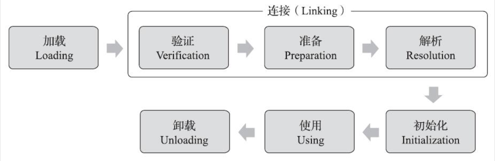
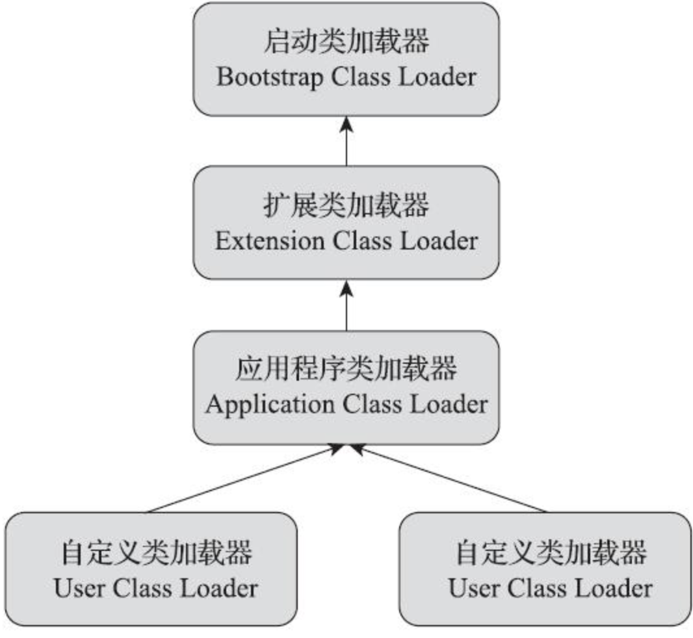
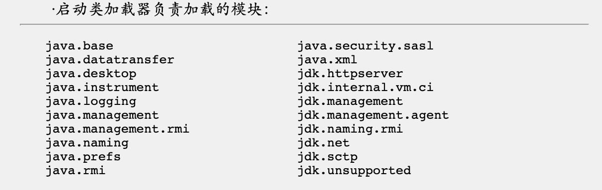
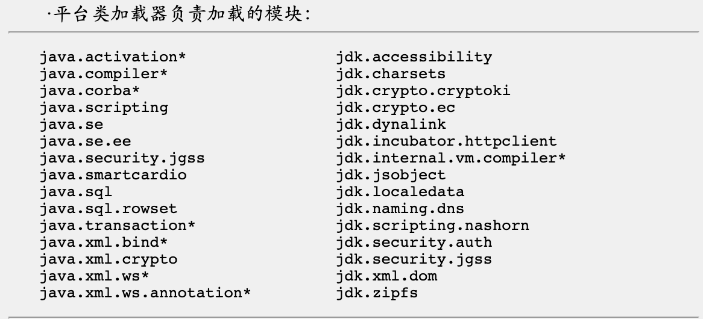
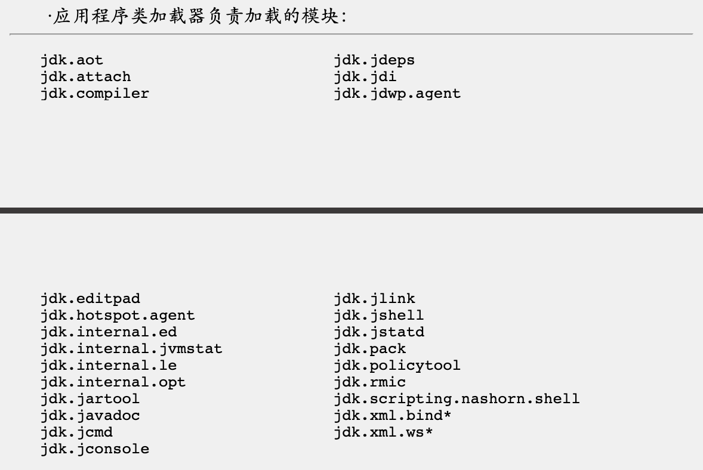

# 类加载

在Java代码中，类型的加载、连接和初始化是在程序运行期间完成的。

类加载器：用于将每个的class文件加载到内存中

## 类的生命周期

* 类加载：查找和载入类的字节码数据
* 连接：
  * 验证：确保被加载的类的正确性，该类是否符合JVM规范
    * 文件格式验证
    * 元数据验证
  * 字节码验证
    * 符号引用验证
  * 准备：为类的静态变量分配内存，并赋值为类型的默认值
  * 解析：在类型的常量池中寻找类、接口、字段和方法的符号引用，将这些符号引用替换成直接引用
* 初始化：将类的静态变量赋于正确的初始值
  * 如果该类还没有被加载和连接，那会先进行加载和连接
* 使用
* 卸载

> Java虚拟机对类的使用有两种：
>
> * 主动使用（会被初始化）
> * 被动使用
>
> JVM规定了以下几种情况必须对类进行初始化（首次主动使用）：
>
> * 创建类的实例
> * 对某个类或接口的静态变量访问、赋值
> * 调用类的静态方法
> * 通过反射的方式获取一个类的对象
> * 初始化一个子类时，会优先初始化其父类
> * Java程序标记为启动类的类，即有main()方法的类
> * 如果一个java.lang.invoke.MethodHandle实例最后解析结果为REF_getStatic、REF_putStatic、REF_invokeStatic、REF_newInvokeSpecial四种类型的方法句柄，并且这个方法句柄对应的类没有进行过初始化，需要先触发初始化
> * 一个接口中定义了默认方法，当该接口的实现类发生了初始化时，该接口需要优先初始化

初始化PS:

> * 对于使用静态变量，只有直接定义这个变量的类会被初始化，而通过子类使用该变量时，子类不会被初始化。
> * 对于使用静态常量，因为静态常量是在编译器就被存放在了调用该常量的方法所在的类的常量池中，不算直接使用，所以不会初始化常量所在的类。
> * 对于数组，其类型是JVM在运行期间生成的，其父类型是Object
> * 一个接口不会因为其子接口或实现类的初始化而初始化，只有该接口被首次使用时，才会初始化。
> * 调用ClassLoader的loadClass方法加载一个类时，并不是对类的主动使用，因此不会初始化该类。
>
> -XX: +TraceClassLoading追踪类的加载信息并打印出来

## 类加载

### 加载过程

加载阶段主要做三件事：

1. 通过类的全限定名来获取该类的字节码文件的二进制数据流
2. 将这个二进制流代表的静态存储结构转为方法区中的数据结构
3. 在内存中创建一个代表该类的java.lang.Class对象，用来封装方法区中的数据结构

### 加载方式

* 从本地系统直接加载
* 通过网络下载.class文件
* 从zip、jar等归档文件中加载.class文件
* 从专有数据库中加载
* 将Java源文件动态编译为.class文件

###加载的结果

类加载的最终结果是内存中的Class对象，Class对象封装了类在方法区的数据结构，并且提供了访问方法区内数据结构的接口。

## 类加载器

有两种类加载器：

1. Java虚拟机自带的

   * 启动类加载器`Bootstrap Class Loader`

     > 启动类加载器负责加载存放在<JAVA_HOME>\lib目录或被-Xbootclasspath参数所指定的路径中存放的，而且是Java虚拟机能够识别的类库加载到虚拟机内存中
     >
     > 由C++实现，不是Class Loader的子类

   * 扩展累加载器`Extension Class Loader`

     > 由sun.misc.Launcher$ExtClassLoader实现
     >
     > 负责加载<JAVA_HOEM>\lib\ext目录中，或者被java.ext.dirs系统变量所指定的路径中所有的类库。

   * 应用类加载器`Application Class Loader`

     > 由sun.misc.Launcher$AppClassLoader实现
     >
     > 负责加载用户类路径上所有的类库，是程序默认的类加载器

2. 用户自定义的

   * java.lang.classLoader的子类

JVM规范允许类加载器在使用某个类之前预先将该类的.class文件载入内存，如果在载入的过程中出现异常，类加载器不会立即抛出该异常，而是在该类被首次使用时再抛出。但是如果这个类一直没有被使用，那就永远也不会抛出异常。

对于任意一个类，必须由加载它的类加载器和这个类本身才能确定其在JVM中的唯一性。通俗的说，就是两个类必须由同一个加载器加载才有“相同”的可能性，否则即使这两个类的class文件相同，被用一个JVM加载，但只要加载它们的类加载器不同，这两个类就肯定不相同。

### 双亲委派模型

当一个类加载器收到加载请求时，它会将加载请求委托给自己的父类加载器（逻辑上），每个层次的加载器都是如此，层层上传，直到启动类加载器。如果父类的加载器无法加载该类，子类加载器才会尝试自己去加载。

## 类的卸载

当一个类被加载、连接、初始化时，这个类的生命周期就开始了，而这个类生命周期的结束是在这个类的class对象不在被引用时结束，JVM会将该class对象在方法区的数据卸载。

由JVM自带的类加载器（启动类加载器、扩展类加载器、应用类加载器）所加载的类，始终都不会被卸载。因为虚拟机本身会始终引用这些类加载器，而这些类加载器会始终引用它们加载的类的class对象。

由用户自定义的类加载器所加载的类是可以被卸载的。

## Java模块化系统

Java模块化系统是以模块来管理包，Java9之前都是运行一个程序会将整个rt.jar文件加载进JVM内存，Java9以后通过模块来管理哪些包是我需要加载的，哪些包是我不需要加载的。

模块化系统支持向后兼容，能够使传统路径依赖的Java程序可以不经修改地直接运行在JDK 9及以后的版本上，同时能够访问所有标准类库模块中到处的包。

* JAR文件在类路径的访问规则：所有类路径下的JAR文件及其他资源文件，都被视为自动打包在一个匿名模块里，该匿名模块是没有隔离的。
* 模块在模块路径的访问规则：模块路径下的模块只能访问到它依赖定义中列出的模块和包，匿名模块对它来说是不可见的
* JAR文件在模块路径的访问规则：JAR文件放在模块路径下，会被认为是一个自动模块，自动模块默认依赖于模块路径中所有模块。

### 模块下的类加载器

* 扩展类加载器被平台类加载器取代

* 平台类加载器和应用类加载器不再派生自java.net.URLClassLoader，而是继承于jdk.internal.loader.BuiltinClassLoader。
* 类的委派关系发生了变动，在平台或应用类加载器将加载请求委派给父加载器前，会先判断该类是否能够归属到某一个系统模块中，如果可以找到这样的归属关系，就会优先委派给负责那个模块的加载器加载。

