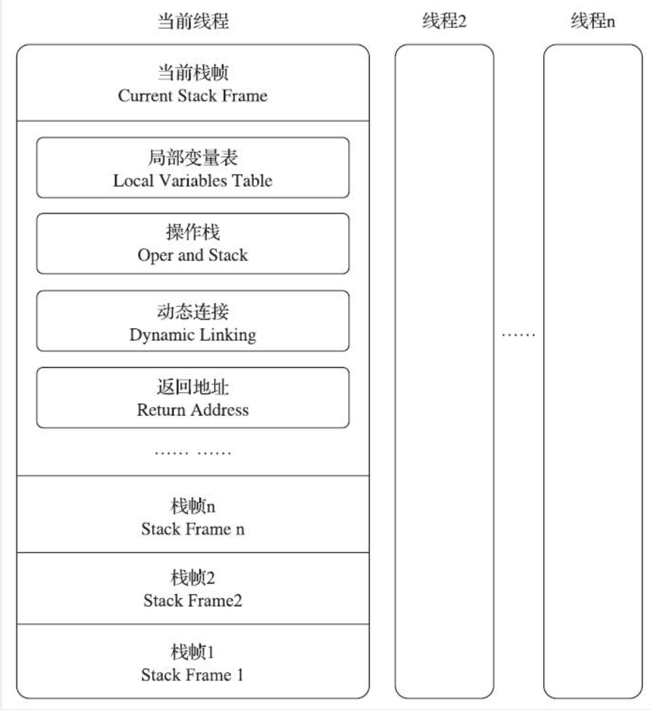

# 字节码执行引擎

## 1、运行时栈帧结构

Java虚拟机以方法作为最基本的执行单元，栈帧用于支持虚拟机进行方法调用和方法执行背后的数据结构。

栈帧存储了方法的局部变量表、操作数栈、动态连接和方法返回地址等信息。

对于执行引擎来说，只有位于栈顶的方法才是在执行的，称为“当前栈帧”，与其关联的方法称为“当前方法”。

### 1.1、局部变量表

局部变量表存放方法参数和方法内部定义的变量。

局部变量表的大小在编译期就确定了，被方法的Code属性的max_locals数据项指定。

局部变量表以变量槽`Slot`为最小单位，一个Slot存放32位的数据类型，包括boolean、byte、char、short、int、float、reference和returnAddress类型的数据。对于64位的数据，会以高位对齐的方式分配两个连续的Slot。

> reference是对一个对象实例的引用，可以根据其直接或间接查找到对象在Java堆中数据存放的起始地址或索引，以及对象的数据类型在方法区中的类型信息。

当实例方法被调用时，局部变量表的第0位索引的Slot默认是存放方法所属对象实例的引用，其余参数按参数列表顺序排列，占用从1开始的Slot。之后，在根据方法内部定义的局部变量顺序和作用域来分配其他Slot。

### 1.2、操作数栈
