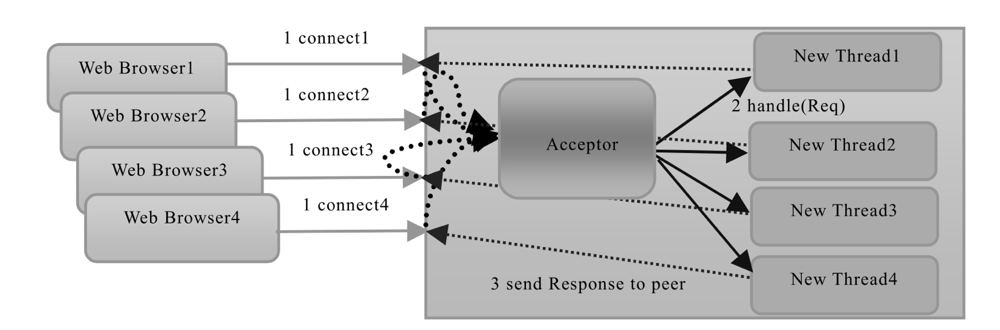
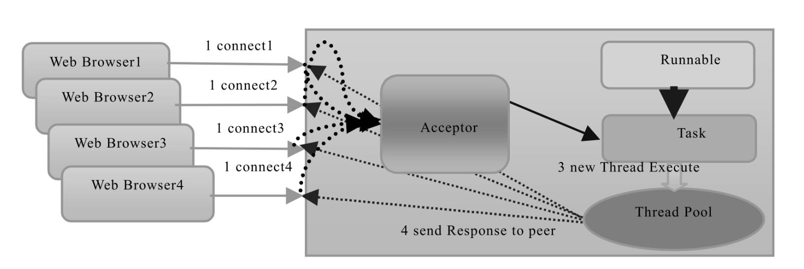

# 1 BIO
## 1.1 传统的BIO
网络编程的基本模型是Clinet/Server模型，服务端提供位置信息（IP地址和监听端口），客户端通过连接操作向服务端监听的地址发起连接请求，建立连接后，双方通过Socket进行通信。   
在BIO中，ServerSocket负责绑定IP地址，启动监听端口；Socket负责发起连接操作。连接成功后，双方通过输入、输出流进行同步阻塞通信。

## 1.2 BIO通信模型图
由一个Acceptor线程负责监听客户端的请求，收到请求后为每个请求创建一个单独的线程进行链路处理。处理完成后，通过输出流返回应答给客户端，线程销毁。

该模型的最大问题是缺乏弹性收缩能力，当客户端请求量过大时，服务端必然会创建大量的线程，而过量线程的创建、销毁会极大的消耗服务端的资源和性能，从而导致服务端系统发生堆栈溢出、创建线程失败等问题，并最终导致宕机。

## 1.3 伪异步I/O
伪异步I/O编程是在BIO的基础上进行的改进版，解决了并发线程消耗资源过大的问题。

当新的请求接受时，会被封装成Task（该任务实现java.lang.Runnable接口）投递到后端的线程池处理，JDK线程池维护一个消息队列和N个活跃线程，对消息队列中的任务进行处理。由于线程池可以设置消息队列的大小和最大线程数，因此它的资源占用是可控的。

伪异步I/O解决了线程资源占用不可控的问题，但是无法解决通信阻塞问题。BIO的API在对Socket的输入流读取时，会一直阻塞，直到发生以下情况：
* 有数据可读
* 可用数据已经读取完毕
* 发生空指针或I/O异常
  
这就意味着如果因网络问题导致通行时间过长，读取的I/O线程会被一直阻塞下去。

# 2 NIO
NIO（Non-block I/O）指非阻塞I/O，提供了ScoketChannel和ServerSocketChannel两种不同的Socket通道实现。这两种通道都支持阻塞和非阻塞两种模式。
