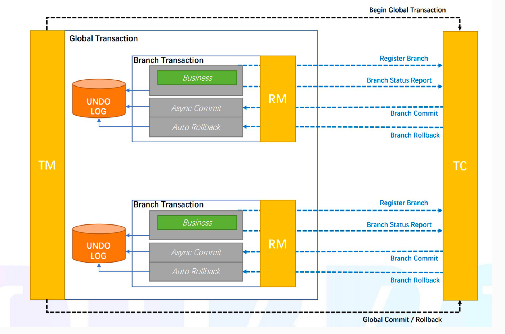

# 1 基础概念
## 1.1 什么是Seata
Seata 是一款开源的分布式事务解决方案，致力于提供高性能和简单易用的分布式事务服务。Seata 将为用户提供了 AT、TCC、SAGA 和 XA 事务模式，为用户打造一站式的分布式解决方案。

官网文档：https://seata.io/zh-cn/docs/overview/what-is-seata.html

## 1.2 角色
TC事务协调者：维护全局和分支事务的状态、驱动全局事务提交或回滚  
TM事务管理器：定义全局事务的范围：开始全局事务、提交或回滚全局事务  
RM资源管理器：管理分支事务处理的资源，与TC交谈以注册分支事务和报告分支事务的状态，并驱动分支事务提交或回滚

## 1.3 事务分组
事务分组是seata的资源逻辑，类似于服务实例。出现某TC集群故障时可以快速failover，只切换对应分组，可以把故障缩减到服务级别。  

首先配置事务分组，程序会通过用户配置的配置中心去寻找service.vgroupMapping .[事务分组配置项]，取得配置项的值就是TC集群的名称，拿到集群名称程序通过一定的前后缀+集群名称去构造服务名，各配置中心的服务名实现不同。拿到服务名去相应的注册中心去拉取相应服务名的服务列表，获得后端真实的TC服务列表

## 1.4 注册中心和配置中心
配置中心用于存放各种配置文件以加载到相应的客户端，比如Seata Client（TM、RM）和Seata Server（TC），支持以下配置方式：file、nacos、consul、apollo、etcd、zookeper。  
注册中心用于记录服务和服务地址的映射关系，进行服务之间的调度，支持以下配置方式：file、nacos、consul、eureka、etcd、zookeper、sofa、redis。

## 1.5 事务模式
Seata支持4种事务模式，分别是AT、TCC、Saga和XA。目前项目中使用的是AT模式

### 1.5.1 AT


AT模式是两阶段提交协议的演变，其特点是对业务无侵入，整体机制分两阶段提交。  
在AT模式下，用户只需关注自己的业务SQL，用户的业务SQL作为一阶段，Seata框架会自动生成事务的二阶段提交和回滚操作。

### 1.5.1 TCC


TCC 模式，不依赖于底层数据资源的事务支持：  
一阶段 prepare 行为：调用 自定义 的 prepare 逻辑。  
二阶段 commit 行为：调用 自定义 的 commit 逻辑。  
二阶段 rollback 行为：调用 自定义 的 rollback 逻辑。

所谓 TCC 模式，是指支持把自定义的分支事务纳入到全局事务的管理中。

# 2 配置

## 2.1 版本号

```xml
<!-- 引入 Spring Cloud Alibaba Seata 相关依赖，使用 Seata 实现分布式事务，并实现对其的自动配置 -->
<dependency>
    <groupId>com.alibaba.cloud</groupId>
    <artifactId>spring-cloud-alibaba-seata</artifactId>
</dependency>
<dependency>
    <groupId>io.seata</groupId>
    <artifactId>seata-spring-boot-starter</artifactId>
    <version>1.4.1</version>
</dependency>
```

## 2.2 file.conf

```
## transaction log store, only used in seata-server
store {
  ## store mode: file、db、redis
  mode = "db"

  ## file store property
  file {
    ## store location dir
    dir = "sessionStore"
    # branch session size , if exceeded first try compress lockkey, still exceeded throws exceptions
    maxBranchSessionSize = 16384
    # globe session size , if exceeded throws exceptions
    maxGlobalSessionSize = 512
    # file buffer size , if exceeded allocate new buffer
    fileWriteBufferCacheSize = 16384
    # when recover batch read size
    sessionReloadReadSize = 100
    # async, sync
    flushDiskMode = async
  }

  ## database store property
  db {
    ## the implement of javax.sql.DataSource, such as DruidDataSource(druid)/BasicDataSource(dbcp)/HikariDataSource(hikari) etc.
    datasource = "druid"
    ## mysql/oracle/postgresql/h2/oceanbase etc.
    dbType = "mysql"
    driverClassName = "com.mysql.jdbc.Driver"
    url = "jdbc:mysql://127.0.0.1:3306/seata"
    user = "root"
    password = "*****"
    minConn = 5
    maxConn = 100
    globalTable = "global_table"
    branchTable = "branch_table"
    lockTable = "lock_table"
    queryLimit = 100
    maxWait = 5000
  }

  ## redis store property
  redis {
    host = "127.0.0.1"
    port = "6379"
    password = ""
    database = "0"
    minConn = 1
    maxConn = 10
    maxTotal = 100
    queryLimit = 100
  }

}
```

## 2.3 registry.conf

```
registry {
    # file 、nacos 、eureka、redis、zk、consul、etcd3、sofa
    type = "nacos"
    loadBalance = "RandomLoadBalance"
    loadBalanceVirtualNodes = 10

    nacos {
      application = "seata-server"
      serverAddr = "127.0.0.1:8848"
      group = "SEATA_GROUP"
      namespace = ""
      cluster = "default"
      username = ""
      password = ""
    }
  }
  
  config {
    # file、nacos 、apollo、zk、consul、etcd3
    type = "file"

    nacos {
      serverAddr = "127.0.0.1:8848"
      namespace = ""
      group = "SEATA_GROUP"
      username = "nacos"
      password = "nacos"
    }
  }
```

## 2.4 服务配置

common通用配置

```properties
#是否开启spring-boot自动装配
seata.enabled=true
#应用名称，默认是各个服务名
seata.application-id=${spring.application.name}
#Seata事务组编号，用于TC集群名Seata服务配置项，对应ServiceProperties类
seata.tx-service-group=${spring.application.name}-group
# 虚拟组和分组的映射
seata.service.vgroup-mapping.${spring.application.name}-group=default
#是否开启数据源自动代理
seata.enableAutoDataSourceProxy=true
seata.registry.type=nacos
seata.registry.nacos.server-addr=172.19.26.206:8848
seata.registry.nacos.namespace=public
seata.registry.nacos.cluster=default
seata.client.rm.lock.retryInterval=10
seata.client.rm.lock.retryTimes=300
```

服务配置

```properties
seata.sharding.enable=true
#默认开启，marketing、message服务为false
seata.enableAutoDataSourceProxy=true 
# 虚拟组和分组的映射
seata.service.vgroup-mapping.sbc-service-goods-group=default
```

## 2.5 相关表
seata库：  
1. gloal_table：全局事务表，每当有一个全局事务发起后，就会在该表中记录全局事务的ID  
2. branch_table：分支事务表，记录每一分支事务ID、分支事务操作等信息  
3. lock_table：全局锁表，记录每个记录（业务数据）锁的信息  
   
各服务库：  
1. undo_log：记录每个库的undo_log日志（每个库都需要有一个）  

# 3 如何使用

使用@GlobalTransactional注解在业务方法上：

```java
public class BusinessServiceImpl implements BusinessService {

    private StorageService storageService;
    private OrderService orderService;
    
    @GlobalTransactional
    public void purchase(String userId, String commodityCode, int orderCount) {
        storageService.deduct(commodityCode, orderCount);
        orderService.create(userId, commodityCode, orderCount);
    }
}
```

被调用方使用@Transactional

```java
public class OrderService {

    @Transactional
    public void create(userId, commodityCode, orderCount) {
        ......
    }
}
```

```java
public class StorageService {

    @Transactional
    public void deduct(commodityCode, orderCount) {
        ......
    }
}
```

# 4 与Sharding的结合

## 4.1 版本和配置文件

Maven依赖

```xml
<dependency>
    <groupId>org.apache.shardingsphere</groupId>
    <artifactId>sharding-transaction-base-seata-at</artifactId>
    <version>4.1.1</version>
</dependency>
```

resources目录引入seata.conf文件

```
sharding.transaction.seata.at.enable = true
client {
    application.id = sbc-service-marketing
    transaction.service.group = sbc-service-marketing-group
}
```

##  4.2 服务配置

```properties
#是否使用sharding
seata.sharding.enable=true

spring.shardingsphere.enabled=false
spring.shardingsphere.datasource.names=master,slave0
spring.shardingsphere.datasource.master.driver-class-name=com.mysql.cj.jdbc.Driver
spring.shardingsphere.datasource.master.type=com.alibaba.druid.pool.DruidDataSource
spring.shardingsphere.datasource.master.url=jdbc:mysql://${wm.mysql.db.master.url}:3306/${wm.mysql.db.name}?characterEncoding=UTF-8&&zeroDateTimeBehavior=convertToNull&autoReconnect=true&failOverReadOnly=false&connectTimeout=0&serverTimezone=Asia/Shanghai&allowMultiQueries=true
spring.shardingsphere.datasource.master.username=${wm.mysql.db.master.username}
spring.shardingsphere.datasource.master.password=${wm.mysql.db.master.password}
spring.shardingsphere.datasource.slave0.driver-class-name=com.mysql.cj.jdbc.Driver
spring.shardingsphere.datasource.slave0.type=com.alibaba.druid.pool.DruidDataSource
spring.shardingsphere.datasource.slave0.url=jdbc:mysql://${wm.mysql.db.slave0.url}:3306/${wm.mysql.db.name}?characterEncoding=UTF-8&&zeroDateTimeBehavior=convertToNull&autoReconnect=true&failOverReadOnly=false&connectTimeout=0&serverTimezone=Asia/Shanghai&allowMultiQueries=true
spring.shardingsphere.datasource.slave0.username=${wm.mysql.db.slave0.username}
spring.shardingsphere.datasource.slave0.password=${wm.mysql.db.slave0.password}
#路由策略
spring.shardingsphere.masterslave.load-balance-algorithm-type=round_robin
spring.shardingsphere.masterslave.master-data-source-name=master
spring.shardingsphere.masterslave.name=ms
spring.shardingsphere.masterslave.slave-data-source-names=slave0
# 开启SQL显示，默认值: false，注意：仅配置读写分离时不会打印日志
spring.shardingsphere.props.sql.show=true
```

### 4.3 配置类

common模块下有DataSourceProxyConfig.java和DataSourceProxyCondition.java两个类，DataSourceProxyCondition通过seata.sharding.enable配置项来区分是否加载shardingsphere，DataSourceProxyConfig是默认的数据库代理，使用spring.datasource.hikari的数据源。

```java
public class DataSourceProxyCondition implements Condition {
    @Override
    public boolean matches(ConditionContext conditionContext, AnnotatedTypeMetadata annotatedTypeMetadata) {
        boolean flag = !"true".equals(conditionContext.getEnvironment().getProperty("seata.sharding.enable"));
        return flag;
    }
}
```

```java
@Configuration
public class DataSourceProxyConfig {

    @Primary
    @Bean
    @Conditional(DataSourceProxyCondition.class)
    @ConfigurationProperties(prefix = "spring.datasource.hikari")
    public DataSource dataSource() {
        return DataSourceBuilder.create()
                .build();
    }
}
```

使用sharding的服务需配置ShardingConfiguration.java

```java
import com.google.common.base.Preconditions;
import io.seata.rm.datasource.DataSourceProxy;
import lombok.RequiredArgsConstructor;
import org.apache.shardingsphere.core.yaml.swapper.ShardingRuleConfigurationYamlSwapper;
import org.apache.shardingsphere.shardingjdbc.api.ShardingDataSourceFactory;
import org.apache.shardingsphere.shardingjdbc.spring.boot.common.SpringBootPropertiesConfigurationProperties;
import org.apache.shardingsphere.shardingjdbc.spring.boot.encrypt.SpringBootEncryptRuleConfigurationProperties;
import org.apache.shardingsphere.shardingjdbc.spring.boot.masterslave.SpringBootMasterSlaveRuleConfigurationProperties;
import org.apache.shardingsphere.shardingjdbc.spring.boot.sharding.ShardingRuleCondition;
import org.apache.shardingsphere.shardingjdbc.spring.boot.sharding.SpringBootShardingRuleConfigurationProperties;
import org.apache.shardingsphere.spring.boot.util.DataSourceUtil;
import org.apache.shardingsphere.spring.boot.util.PropertyUtil;
import org.apache.shardingsphere.underlying.common.config.exception.ShardingSphereConfigurationException;
import org.apache.shardingsphere.underlying.common.config.inline.InlineExpressionParser;
import org.springframework.boot.autoconfigure.condition.ConditionalOnProperty;
import org.springframework.boot.context.properties.EnableConfigurationProperties;
import org.springframework.context.EnvironmentAware;
import org.springframework.context.annotation.Bean;
import org.springframework.context.annotation.Conditional;
import org.springframework.context.annotation.Configuration;
import org.springframework.core.env.Environment;
import org.springframework.core.env.StandardEnvironment;
import org.springframework.jndi.JndiObjectFactoryBean;

import javax.naming.NamingException;
import javax.sql.DataSource;
import java.sql.SQLException;
import java.util.*;

@Configuration
@EnableConfigurationProperties({
        SpringBootShardingRuleConfigurationProperties.class,
        SpringBootMasterSlaveRuleConfigurationProperties.class, SpringBootEncryptRuleConfigurationProperties.class, SpringBootPropertiesConfigurationProperties.class})
@ConditionalOnProperty(prefix = "spring.shardingsphere", name = "enabled", havingValue = "true", matchIfMissing = true)
@RequiredArgsConstructor
public class ShardingConfiguration implements EnvironmentAware {

    private final SpringBootShardingRuleConfigurationProperties shardingProperties;

    private final SpringBootPropertiesConfigurationProperties propMapProperties;

    private final Map<String, DataSource> dataSourceMap = new LinkedHashMap<>();

    private final static String JNDI_NAME = "jndi-name";

    @Bean
    @Conditional(ShardingRuleCondition.class)
    public DataSource shardingDataSource() throws SQLException {
        return ShardingDataSourceFactory.createDataSource(dataSourceMap, new ShardingRuleConfigurationYamlSwapper().swap(shardingProperties), propMapProperties.getProps());
    }

    @Override
    public final void setEnvironment(final Environment environment) {
        String prefix = "spring.shardingsphere.datasource.";
        for (String each : getDataSourceNames((StandardEnvironment) environment, prefix)) {
            try {
                dataSourceMap.put(each, getDataSource(environment, prefix, each));
            } catch (final ReflectiveOperationException ex) {
                throw new ShardingSphereConfigurationException("Can't find datasource type!", ex);
            } catch (final NamingException namingEx) {
                throw new ShardingSphereConfigurationException("Can't find JNDI datasource!", namingEx);
            }
        }
    }

    private List<String> getDataSourceNames(final StandardEnvironment environment, final String prefix) {
        environment.setIgnoreUnresolvableNestedPlaceholders(true);
        return null == environment.getProperty(prefix + "name")
                ? new InlineExpressionParser(environment.getProperty(prefix + "names")).splitAndEvaluate() : Collections.singletonList(environment.getProperty(prefix + "name"));
    }

    @SuppressWarnings("unchecked")
    private DataSource getDataSource(final Environment environment, final String prefix, final String dataSourceName) throws ReflectiveOperationException, NamingException {
        Map<String, Object> dataSourceProps = PropertyUtil.handle(environment, prefix + dataSourceName.trim(), Map.class);
        Preconditions.checkState(!dataSourceProps.isEmpty(), "Wrong datasource properties!");
        Object jndiNameValue = dataSourceProps.get(JNDI_NAME);
        if (Objects.nonNull(jndiNameValue)) {
            return getJndiDataSource(jndiNameValue.toString());
        }

        return new DataSourceProxy(DataSourceUtil.getDataSource(dataSourceProps.get("type").toString(), dataSourceProps));
    }

    private DataSource getJndiDataSource(final String jndiName) throws NamingException {
        JndiObjectFactoryBean bean = new JndiObjectFactoryBean();
        bean.setResourceRef(true);
        bean.setJndiName(jndiName);
        bean.setProxyInterface(DataSource.class);
        bean.afterPropertiesSet();
        return (DataSource) bean.getObject();
    }
}
```

# 5 与Mongo的结合

## 5.1 Mongo版本

mongo版本须在4.0以上，目前使用的版本是4.2。使用mongo本身的事物控制，需要设置主副本。

## 5.2 配置

配置项

```properties
mongo.transaction.enable=true
```

配置类

```java
@Configuration
public class MongoConfig {
    @Bean
    @ConditionalOnProperty(prefix = "mongo.transaction",value = "enable",havingValue = "true")
    MongoTransactionManager transactionManager(MongoDatabaseFactory dbFactory) {
        return new MongoTransactionManager(dbFactory);
    }
}
```

## 5.3 使用方式

在入口处添加@Transactional和@GlobalTransactional

```java
@Transactional
@GlobalTransactional
public List<TradeCommitResult> commit(TradeCommitRequest tradeCommitRequest)
```

mongo事务不支持分布式，只能是单机的事务，所以操作mongo的事务应用必须是发起者和结束者，而且只能在当前服务中使用事务。以下单为例，通过order服务发起，由order去调用其他的服务，而mongo的数据操作仅存在order服务中，其他的只是mysql的操作，当其他服务和order服务出错了mongo的数据可以回滚。  

注意：
1. 单个事务操作的文档大小不能超过16M。因为事务操作是在事务提交之后记录一条oplog。
2. 如果是集群部署链接不能够配置readPreference=secondaryPreferred，如果开启了事务则回报错。

# 6 TCC

## 6.1 应用背景

目前项目中使用的AT模式，是基于本地事务做的全局控制，如果数据源本身不支持事务，那么Seata就无法控制。项目目前支持事务有mysql和mongo，但有些场景使用的数据源不止这两种，例如下单扣减库存。下单的商品库存除了Mysql中会存储外，还会在redis中存放一份。在扣减或增加的过程中，如果在后续的操作中发现异常，那redis的数据就会异常。

## 6.2 使用方式

类上使用@LocalTcc，注册一个分支事务

```java
@LocalTCC
public interface GoodsInfoStockTccInterface {
    
}
```

方法上使用@TwoPhaseBusinessAction，指定try方法、Confirm方法、Cancel方法

```java
@TwoPhaseBusinessAction(
        name = "subStock",
        commitMethod = "subCommit",
        rollbackMethod = "subRollback")
boolean subStock(@BusinessActionContextParameter(paramName = "dtoList")
                List<GoodsInfoMinusStockDTO> dtoList);
```
try、confirm、cancel方法根据业务自定义实现。


# 7 注意事项

1. @GlobalTransactional需要使用在类的入口方法上，其实现方式与Spring事务机制类似，通过AOP实现。
2. 每个业务库中必须包含 undo_log 表，若与分库分表组件联用，分库不分表
3. lock_table表会记录被加锁的表名，需注意业务表名长度限制
4. @Transactional和@GlobalTransaction连用，@Transactional 只能位于标注在@GlobalTransaction的同一方法层次或者位于@GlobalTransaction 标注方法的内层。
5. 目前项目中AT模式只支持mysql和mongo